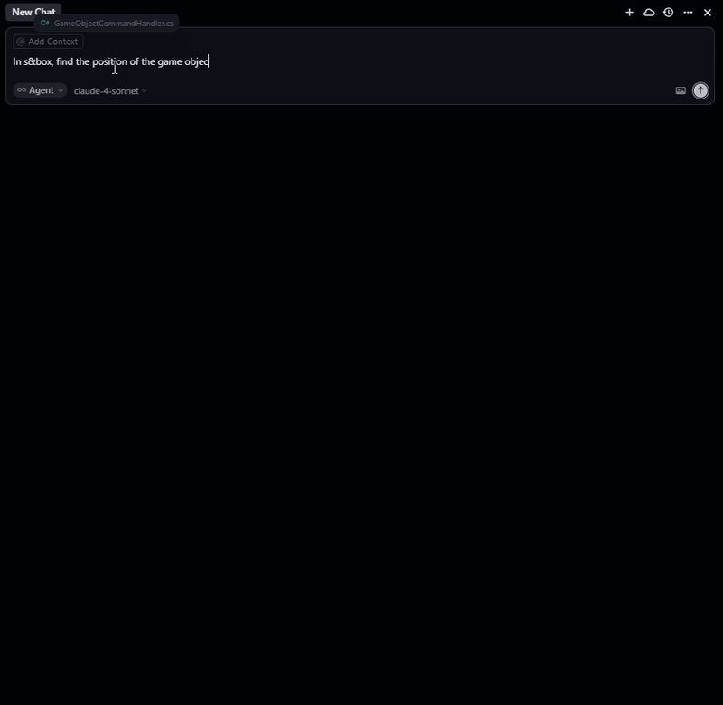

# Model Context Protocol for s&box

[](https://dotnet.microsoft.com/)
[](https://sbox.game/)

[](https://cursor.com/install-mcp?name=sbox&config=JTdCJTIyY29tbWFuZCUyMiUzQSUyMmRvY2tlciUyMHJ1biUyMC0tcm0lMjAtaSUyMC0tbmFtZSUyMHNib3gtbWNwLXNlcnZlci1jdXJzb3IlMjAtcCUyMDgwODAlM0E4MDgwJTIwZ2hjci5pbyUyRnN1aXJhbWRldiUyRnNib3gtbWNwLXNlcnZlciUzQWxhdGVzdCUyMiUyQyUyMnR5cGUlMjIlM0ElMjJodHRwJTIyJTJDJTIyZW5hYmxlJTIyJTNBdHJ1ZSUyQyUyMnVybCUyMiUzQSUyMmh0dHAlM0ElMkYlMkZsb2NhbGhvc3QlM0E4MDgwJTIyJTdE)

> [!IMPORTANT]
> This project is currently under active development.

A Model Context Protocol (MCP) server that enables AI assistants to interact with the s&box editor through real-time WebSocket communication.

This MCP server works in conjunction with the separate [s&box Adapter Library](https://github.com/suiramdev/sbox-mcp-library) to provide seamless integration between AI assistants and your s&box projects.



## Prerequisites

- [Docker](https://www.docker.com/get-started) (recommended)
- [s&box](https://sbox.game/)
- An [AI assistant that supports MCP](https://docs.cursor.com/mcp/introduction) (for example, Cursor, Claude Desktop, etc.) is suggested

## Quick Start

### Step 1: Install and Run the MCP Server

To get started, make sure you have Docker installed on your system. Cursor users can simply click the button below to install and launch the MCP Server automatically, or you can follow the manual instructions below.

[](https://cursor.com/install-mcp?name=sbox&config=JTdCJTIyY29tbWFuZCUyMiUzQSUyMmRvY2tlciUyMHJ1biUyMC0tcm0lMjAtaSUyMC0tbmFtZSUyMHNib3gtbWNwLXNlcnZlci1jdXJzb3IlMjAtcCUyMDgwODAlM0E4MDgwJTIwZ2hjci5pbyUyRnN1aXJhbWRldiUyRnNib3gtbWNwLXNlcnZlciUzQWxhdGVzdCUyMiUyQyUyMnR5cGUlMjIlM0ElMjJodHRwJTIyJTJDJTIyZW5hYmxlJTIyJTNBdHJ1ZSUyQyUyMnVybCUyMiUzQSUyMmh0dHAlM0ElMkYlMkZsb2NhbGhvc3QlM0E4MDgwJTIyJTdE)

<details>
<summary style="color: lightgray;">Manual Installation using Docker</summary>

<br />

1. **Build the Docker image**
    ```bash
        docker build -t sbox-mcp-server .
    ```
2. **Run the container**
    ```bash
        docker run -d -p 8080:8080 --name sbox-mcp-server sbox-mcp-server
    ```
3. **Use the MCP Server in your AI assistant**
    ```json
    {
      "mcpServers": {
        "sbox": {
          "command": "docker",
          "args": [
            "run",
            "--rm",
            "-i",
            "--name", "sbox-mcp-server-cursor",
            "--force-rm",
            "-p", "8080:8080",
            "sbox-mcp-server"
          ]
        }
      }
    }
    ```

</details>

<details>
<summary style="color: lightgray;">Manual Installation using .NET SDK</summary>

<br />

1. **Build the server**
    ```bash
        dotnet build
    ```
2. **Run the container**
    ```bash
        dotnet run
    ```
3. **Use the MCP Server in your AI assistant**
    ```json
    {
      "mcpServers": {
        "sbox": {
          "transport": "http",
          "url": "http://localhost:8080"
        }
      }
    }
    ```

</details>

### Step 2: Install the Adapter Library in s&box

To enable interaction with s&box, you need to install the adapter library. This library allows the MCP Server to communicate with the s&box editor.

1. **Install the Adapter Library** from the [sbox-mcp-library repository](https://github.com/suiramdev/sbox-mcp-library)

2. **Follow the setup instructions** in the Adapter Library repository to:
   - Install the library in your s&box project through the Asset Library
   - Connect to this MCP Server

> [!IMPORTANT]
> The server must be running for the s&box adapter library to function. Please ensure the server is running before proceeding to the next step.

## Usage

Once both this MCP Server and the s&box Adapter Library are installed and connected, you can interact with your s&box editor using natural language through your AI assistant:

```
"Create a ModelRenderer component on the Cube object"
"Find all game objects named 'Player'"
"Set the Scale property of the Transform component on MainCamera to 2,2,2"
"Remove the Rigidbody component from the Ball object"
"Show me all components attached to the Ground object"
```

## Architecture

This MCP Server acts as a bridge between:
- **AI Assistant** ↔ **This MCP Server** ↔ **s&box Adapter Library** ↔ **s&box Editor**

The MCP Server:
- Receives commands from AI assistants via the Model Context Protocol
- Translates MCP tool calls into structured WebSocket commands
- Sends commands to the s&box Adapter Library for execution
- Returns responses back to AI assistants

## Contributing

Contributions are welcome! Please feel free to submit a Pull Request. For major changes, please open an issue first to discuss what you would like to change.

### Related Repositories

- **This Repository**: [sbox-mcp-server](https://github.com/suiramdev/sbox-mcp-server) - The main MCP server component
- **Adapter Library**: [sbox-mcp-library](https://github.com/suiramdev/sbox-mcp-library) - s&box integration library

## Support

- **Issues**: [GitHub Issues](https://github.com/suiramdev/sbox-mcp-server/issues)
- **Discussions**: [GitHub Discussions](https://github.com/suiramdev/sbox-mcp-server/discussions)
- **Adapter Library Support**: [sbox-mcp-library Issues](https://github.com/suiramdev/sbox-mcp-library/issues)
