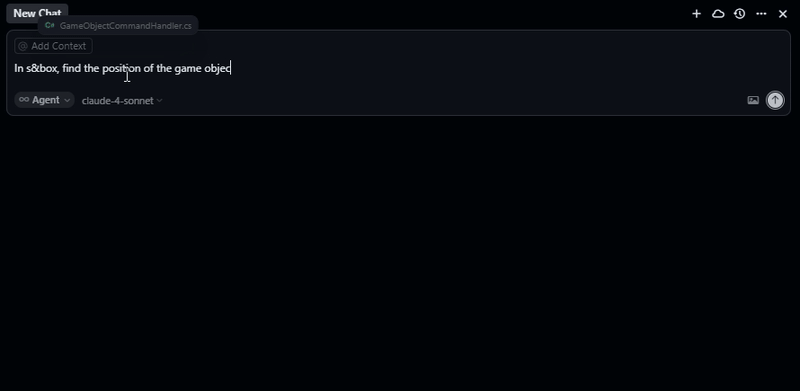

# Model Context Protocol for s&box

[](https://dotnet.microsoft.com/)
[](https://sbox.game/)

A Model Context Protocol (MCP) server implementation that enables AI assistants to interact with the s&box editor through real-time WebSocket communication.



## Architecture

The system uses a two-tier architecture for seamless AI-to-editor communication:

```
AI Assistant ↔ MCP Server ↔ WebSocket ↔ s&box Editor
```

1. **AI Assistant** communicates with the MCP Server using the Model Context Protocol over stdio
2. **MCP Server** translates MCP tool calls into structured commands and sends them via WebSocket
3. **s&box Editor** receives commands, executes them using the game engine API, and sends responses back
4. **Responses** flow back through the same path to provide real-time feedback to the AI assistant

## Prerequisites

- [.NET 9.0 SDK](https://dotnet.microsoft.com/download/dotnet/9.0) or later
- [s&box](https://sbox.game/) (latest version)
- An MCP-compatible AI assistant (Claude Desktop, Cursor, etc.)

## Quick Start

### 1. Build and Run the Server

#### Using the Build Script (Recommended)

```powershell
.\build.ps1 run
```

#### Manual Build

```bash
cd Server
dotnet build
dotnet run
```

### 2. Configure Your AI Assistant

Add the MCP server to your AI assistant configuration:

#### For Cursor Editor (mcp.json):
```json
{
  "mcpServers": {
    "sbox": {
      "command": "cmd",
      "type": "stdio",
      "enable": true,
      "args": [
        "/c", 
        "<path-to-your-project>\\Server\\bin\\win-x64\\SandboxModelContextProtocol.Server.exe"
      ]
    }
  }
}
```

### 3. Connect from s&box

1. Start the MCP server
2. Open your s&box project in the editor
3. Navigate to **MCP → Connect to MCP Server** in the menu bar
4. You'll hear a success sound when connected and a success message in the console

## Available Tools

### Component Management

| Tool                   | Description                                   | Parameters                                                       |
| ---------------------- | --------------------------------------------- | ---------------------------------------------------------------- |
| `CreateComponent`      | Creates a new component on a game object      | `componentType`, `gameObjectId`                                  |
| `GetComponents`        | Gets all components attached to a game object | `gameObjectId`                                                   |
| `GetComponent`         | Gets a specific component by type             | `componentType`, `gameObjectId`                                  |
| `RemoveComponent`      | Removes a component from a game object        | `componentType`, `gameObjectId`                                  |
| `SetComponentProperty` | Sets a property value on a component          | `componentType`, `propertyName`, `propertyValue`, `gameObjectId` |

### Game Object Management

| Tool                    | Description                             | Parameters |
| ----------------------- | --------------------------------------- | ---------- |
| `FindGameObjectsByName` | Finds game objects by name in the scene | `name`     |

## Example AI Conversations

Once connected, you can interact with your s&box project using natural language:

```
"Create a ModelRenderer component on the Cube object"
"Find all game objects named 'Player'"
"Set the Scale property of the Transform component on MainCamera to 2,2,2"
"Remove the Rigidbody component from the Ball object"
"Show me all components attached to the Ground object"
```

## Configuration

The server can be configured via `Server/appsettings.json`:

```json
{
  "WebSocket": {
    "Url": "http://localhost:8080",
    "Path": "/ws"
  }
}
```

> **Note**: Port 8080 is the recommended WebSocket port for s&box local development.

## Build Script Options

The included PowerShell build script (`build.ps1`) provides comprehensive build management:

| Command                   | Description                           |
| ------------------------- | ------------------------------------- |
| `.\build.ps1`             | Default build (Release configuration) |
| `.\build.ps1 build`       | Build in Release mode                 |
| `.\build.ps1 build-debug` | Build in Debug mode                   |
| `.\build.ps1 run`         | Run the server                        |
| `.\build.ps1 run-debug`   | Run in debug mode                     |
| `.\build.ps1 publish`     | Create self-contained executable      |
| `.\build.ps1 clean`       | Clean build artifacts                 |
| `.\build.ps1 rebuild`     | Full clean rebuild                    |
| `.\build.ps1 test`        | Run unit tests                        |
| `.\build.ps1 help`        | Show all available options            |

## Development

### Project Structure

```
modelcontextprotocol/
├── Server/                 # MCP Server implementation
│   ├── Tools/             # MCP tool definitions
│   ├── Services/          # Core services (WebSocket, Commands)
│   ├── Models/            # Data models
│   └── Program.cs         # Entry point
├── Editor/                # s&box Editor integration
│   ├── Commands/          # Command handlers
│   ├── Services/          # Editor services
│   └── EditorMenu.cs      # Menu integration
├── build.ps1              # Build automation script
└── README.md              # This file
```

## Contributing

Contributions are welcome! Please feel free to submit a Pull Request. For major changes, please open an issue first to discuss what you would like to change.

## Support

- **Issues**: [GitHub Issues](https://github.com/suiramdev/sbox-mcp-server/issues)
- **Discussions**: [GitHub Discussions](https://github.com/suiramdev/sbox-mcp-server/discussions)